# ISA authoring tools architecture

## Objective

The authoring tools provide operations over the current ISA source tree,
including `check` and `alloc`, and typed projections for later Sail and document
commands. Every projection is derived from the current source objects and
metasyntax parsers rather than a parallel consumer-specific model.

The source tree groups executable Sail and explanatory TeX under their owning
architectural domains. A base or extension `model.yaml` independently declares
Sail dependency units and owner-local TeX topic sources. Reader-facing
artifacts own composition and order separately; the owner manifest does not
turn its topic inventory into a public projection or replace either source
language with a second description of architectural behavior.

Primitive operation families follow the same ownership boundary. Base integer
families are declared under `isa/execution/semantics/primitives/`; an extension's
families are declared under that extension's `semantics/primitives/` directory
and included by its `model.yaml`. Families remain purpose-specific instead of
forming one architecture-wide operation union. Instruction-local Sail selects a primitive;
YAML does not encode or interpret that execution choice.

An operation starts instruction-local. It is promoted into an owner's primitive
library only after a second instruction consumes the same behavior or the
operation becomes an explicit external or micro-operation contract. Operand
shape, destination choice, and flag-commit policy remain in instruction adapters
and do not create primitive families or constructors by themselves.

When several extensions contribute to a shared execution service, the service
declares a scattered Sail function and each extension contributes only its own
clauses. Shared code may define the interface and neutral transport contract,
but must not enumerate another extension's semantic operations.

The first implementation boundary is `check`.  Later commands consume the same
loaded project rather than loading or interpreting YAML independently.

## Class graph

```mermaid
classDiagram
    direction LR

    class IsaProject {
        +Path root
        +TypeSystem types
        +SourceCatalog catalog
        +CpuidCatalog cpuid
        +EventCatalog events
        +ModelCatalog model
        +load(root) IsaProject
        +bundle(ref) InstructionBundle
        +extension(id) Extension
        +select(targets) tuple~InstructionBundle~
    }

    class SourceCatalog {
        +ReferenceIndex~InstructionBundle~ instructions
        +ReferenceIndex~EAMode~ ea_modes
        +tuple~Reference~ instruction_order
        +InstructionSet base
        +Mapping~str, Extension~ extensions
        +ExtensionSetCatalog extension_catalog
        +discover(root, types) SourceCatalog
    }

    class ExtensionSetCatalog {
        +Path source
        +Path root
        +tuple~str~ declared
        +tuple~str~ actual
    }

    class CpuidCatalog {
        +Mapping~str, CpuidNamespace~ namespaces
        +CpuidReferenceIndexes references
        +load(isa_root, extensions) CpuidCatalog
    }

    class CpuidNamespace {
        +str owner
        +Path root
        +CpuidInventory class_inventory
        +Mapping~str, CpuidClass~ classes
    }

    class CpuidClass {
        +Reference reference
        +int value
        +Reference extends
        +CpuidInventory leaf_inventory
        +Mapping~str, CpuidLeaf~ leaves
    }

    class CpuidLeaf {
        +Reference reference
        +int value
        +Reference extends
        +tuple~CpuidQuery~ queries
    }

    class CpuidQuery {
        +Reference reference
        +CpuidIndexRange indexes
        +tuple~CpuidField~ fields
    }

    class CpuidField {
        +Reference reference
        +int lsb
        +int bits
    }

    class EventCatalog {
        +Mapping~str, EventNamespace~ namespaces
        +EventReferenceIndexes references
        +load(isa_root, extensions) EventCatalog
        +root_class(class) EventClass
        +selected_events(owners) tuple
    }

    class EventNamespace {
        +str owner
        +EventInventory class_inventory
        +Mapping~str, EventClass~ classes
    }

    class EventClass {
        +Reference reference
        +int value
        +EventSelector selector
        +Reference extends
        +EventInventory event_inventory
        +Mapping~str, ArchitecturalEvent~ events
    }

    class ArchitecturalEvent {
        +Reference reference
        +int code
        +str family
        +str frame
        +tuple~str~ payload
    }

    class Extension {
        +ExtensionMetadata metadata
        +TypeNamespace types
        +InstructionSet instruction_set
        +tuple~Extension~ requires
        +tuple~CpuidField~ required_cpuid_flags
    }

    class ExtensionMetadata {
        +str id
        +str name
        +tuple~str~ requires
        +tuple~str~ required_cpuid_flags
        +Path source
        +Path root
        +load(path, isa_root) ExtensionMetadata
    }

    class InstructionSet {
        +InstructionSetCatalog catalog
        +tuple~InstructionBundle~ instructions
    }

    class InstructionSetCatalog {
        +str owner
        +Path source
        +Path root
        +tuple~str~ declared
        +tuple~str~ actual
    }

    class InstructionBundle {
        +Reference reference
        +Instruction instruction
        +EncodingCatalog encodings
        +ArtifactSet artifacts
        +tuple~CpuidField~ required_cpuid_flags
    }

    class ArtifactSet {
        +Path semantics
        +Path description
    }

    class ModelCatalog {
        +ModelNamespace base
        +Mapping~str, ModelNamespace~ extensions
        +Mapping~str, SailUnit~ sail_units
        +tuple~str~ sail_order
        +Mapping~str, DocumentTopic~ document_topics
        +load(isa_root, extensions) ModelCatalog
    }

    class ModelNamespace {
        +str owner
        +Path source
        +Path root
        +tuple~SailUnit~ sail_units
        +tuple~DocumentTopic~ document_topics
    }

    class SailUnit {
        +str owner
        +str id
        +tuple~Path~ sources
        +tuple~str~ requires
    }

    class DocumentTopic {
        +str owner
        +str id
        +Path document
    }

    class Instruction {
        +Path source
        +validate()
        +load(path, isa_root) Instruction
    }

    class EncodingCatalog {
        +Path source
        +tuple~EncodingForm~ forms
        +load(path, types) EncodingCatalog
    }

    class EncodingForm {
        +str id
        +EncodingMetasyntax pattern
        +InstructionMetasyntax syntax
        +tuple~FieldBinding~ fields
        +tuple~PayloadBinding~ payloads
        +tuple~OperandConstraint~ constraints
        +tuple~OperandOverlap~ overlaps
    }

    class FieldBinding {
        +str marker
        +str role
        +Reference type
    }

    class PayloadBinding {
        +str role
        +Reference type
    }

    class OperandConstraint {
        +str role
        +tuple allow
        +tuple exclude
        +str reason
    }

    class OperandOverlap {
        +tuple~str~ operands
        +str type
    }

    class TypeSystem {
        +TypeNamespace base
        +Mapping~str, TypeNamespace~ extensions
        +ReferenceIndex~FieldType~ field_types
        +ReferenceIndex~PayloadType~ payload_types
        +load(isa_root) TypeSystem
        +namespace(owner) TypeNamespace
    }

    class TypeNamespace {
        +str owner
        +Path root
        +ReferenceIndex~FieldType~ field_types
        +ReferenceIndex~PayloadType~ payload_types
    }

    class FieldType {
        +Reference reference
        +Path source
        +FieldTypeKind kind
        +int bits
        +tuple~FieldValue~ values
    }

    class FieldValue {
        +int value
        +str code
    }

    class PayloadType {
        +Reference reference
        +Path source
        +PayloadTypeKind kind
        +int bytes
    }

    class ReferenceIndex~T~ {
        +register(reference, value) Reference
        +resolve(reference) T
    }

    class EAMode {
        +Path source
        +validate()
        +load(path, isa_root) EAMode
    }

    class EncodingMetasyntax {
        +int bit_width
        +int fixed_mask
        +int fixed_value
        +overlaps(other) bool
    }

    class InstructionMetasyntax {
        +str mnemonic
        +tuple selected_size_codes
        +displayed_operands()
        +encoding_id() str
    }

    class Diagnostic {
        +Severity severity
        +str code
        +Path source
        +tuple path
        +str message
        +tuple~RelatedLocation~ related
    }

    class DiagnosticBag {
        +add(diagnostic)
        +extend(diagnostics)
        +has_errors bool
        +render_text() str
        +render_json() str
    }

    class CheckService {
        +check(project, targets) DiagnosticBag
    }

    class BundleValidator {
        +validate(bundle, project) Iterable~Diagnostic~
    }

    class CatalogValidator {
        +validate(project) Iterable~Diagnostic~
    }

    class AllocationAnalyzer {
        +analyze(project, targets) AllocationMap
        +summaries(project) tuple~AllocationSummary~
        +entries(project, class, filters) tuple~AllocationEntry~
        +check_candidate(project, class, pattern) CandidateCheck
        +holes(project, class, filters) tuple~AllocationHole~
    }

    class EncodingClass {
        +str name
        +int opcode_space_bytes
        +int framing_bits
        +int allocation_bits
        +tuple~str~ namespace
    }

    class OperatorSpace {
        +str encoding_class
        +str name
        +str prefix
    }

    class AllocationMap {
        +tuple~AllocationEntry~ entries
        +tuple~AllocationCollision~ collisions
        +summaries() tuple~AllocationSummary~
        +render_text() str
        +render_json() str
    }

    class AllocationEntry {
        +Reference reference
        +str mnemonic
        +str form_id
        +str pattern
        +tuple~AllocationCube~ raw_cubes
        +tuple~AllocationCube~ legal_cubes
        +int raw_slots
        +int assigned_slots
        +int reclaimed_slots
    }

    class AllocationCube {
        +int width
        +int mask
        +int value
        +int slots
        +str pattern
        +overlaps(other) bool
        +contains(other) bool
        +intersection(other) AllocationCube
    }

    class AllocationCollision {
        +AllocationEntry left
        +AllocationEntry right
    }

    class AllocationHole {
        +AllocationCube cube
        +str pattern
        +int slots
    }

    class CandidateCheck {
        +str encoding_class
        +str pattern
        +int allocated_slots
        +int reclaimed_slots
        +int clean_free_slots
    }

    class PreviewService {
        +build(bundle, project) InstructionPreview
    }

    class InstructionPreview {
        +str title
        +tuple forms
        +tuple operands
        +str description
        +tuple diagrams
    }

    class HtmlPreviewRenderer {
        +render(preview) str
    }

    class ScaffoldService {
        +create(project, mnemonic, owner) InstructionBundle
    }

    class FormatService {
        +format(project, targets, check_only) DiagnosticBag
    }

    IsaProject *-- TypeSystem
    IsaProject *-- SourceCatalog
    IsaProject *-- CpuidCatalog
    IsaProject *-- EventCatalog
    IsaProject *-- ModelCatalog
    ModelCatalog *-- ModelNamespace
    ModelNamespace *-- SailUnit
    ModelNamespace *-- DocumentTopic
    CpuidCatalog *-- "many" CpuidNamespace
    CpuidCatalog o-- ReferenceIndex
    CpuidNamespace *-- "many" CpuidClass
    CpuidClass *-- "many" CpuidLeaf
    CpuidLeaf *-- "many" CpuidQuery
    CpuidQuery *-- "many" CpuidField
    EventCatalog *-- "many" EventNamespace
    EventCatalog o-- ReferenceIndex
    EventNamespace *-- "many" EventClass
    EventClass *-- "many" ArchitecturalEvent
    SourceCatalog *-- "many" InstructionBundle
    SourceCatalog *-- "many" EAMode
    SourceCatalog *-- InstructionSet : base
    SourceCatalog *-- ExtensionSetCatalog
    SourceCatalog *-- "many" Extension
    Extension o-- "many" Extension : requires
    Extension *-- ExtensionMetadata
    Extension o-- TypeNamespace
    Extension *-- InstructionSet
    InstructionSet *-- InstructionSetCatalog
    InstructionSet o-- "many" InstructionBundle
    SourceCatalog o-- ReferenceIndex
    TypeSystem o-- ReferenceIndex
    TypeSystem *-- TypeNamespace
    TypeNamespace *-- "many" FieldType
    TypeNamespace *-- "many" PayloadType
    FieldType *-- "many" FieldValue
    InstructionBundle *-- Instruction
    InstructionBundle *-- EncodingCatalog
    InstructionBundle *-- ArtifactSet
    EncodingCatalog *-- "many" EncodingForm
    EncodingForm *-- EncodingMetasyntax
    EncodingForm *-- InstructionMetasyntax
    EncodingForm *-- "many" FieldBinding
    EncodingForm *-- "many" PayloadBinding
    EncodingForm *-- "many" OperandConstraint
    EncodingForm *-- "many" OperandOverlap

    CheckService --> IsaProject
    CheckService *-- BundleValidator
    CheckService *-- CatalogValidator
    CheckService --> DiagnosticBag
    BundleValidator --> Diagnostic
    CatalogValidator --> Diagnostic
    AllocationAnalyzer --> IsaProject
    AllocationAnalyzer --> EncodingClass
    EncodingClass o-- OperatorSpace
    AllocationAnalyzer --> AllocationMap
    AllocationMap *-- "many" AllocationEntry
    AllocationMap *-- "many" AllocationCollision
    AllocationEntry *-- "many" AllocationCube
    AllocationCollision --> AllocationEntry
    AllocationAnalyzer --> AllocationHole
    AllocationAnalyzer --> CandidateCheck
    PreviewService --> InstructionBundle
    PreviewService --> InstructionPreview
    HtmlPreviewRenderer --> InstructionPreview
    ScaffoldService --> IsaProject
    FormatService --> IsaProject
    FormatService --> DiagnosticBag
```



## Ownership boundaries

### Loading

`IsaProject` is the only public entry point for loading a tree.  It loads the
`TypeSystem`, asks `SourceCatalog` to discover base and extension catalogs in
their declared order, and loads the distributed `CpuidCatalog` and
`EventCatalog`. A command must not use `Path.rglob()` to construct its own
inventory.

`CpuidNamespace` owns the CPUID fragments stored under the base ISA root or one
declared extension root. Each namespace has the same
`cpuid/classes/<class>/leaves/<leaf>` structure. A class or leaf either assigns
its numeric value or names an existing logical reference through `extends`.
`CpuidCatalog` publishes typed global reference indexes using
`<owner>.cpuid.<class>.<leaf>.<query>.<field>` and does not include filesystem
catalog names in logical references. Selector widths and composition remain
Python and architectural invariants rather than authored database properties.

`EventNamespace` owns the event fragments stored beneath the base ISA root or
one declared extension root. Every namespace uses the hierarchy
`events/classes/<class>/events/<event>`. Base class definitions allocate the
8-bit event class and select how its 24-bit selector is obtained. Extension
class fragments use `extends` to contribute leaf events to an existing class;
the extension never duplicates the numeric class allocation.

Every `ArchitecturalEvent` is directly deliverable. Former cause values are
represented as separate leaf events rather than as a second dispatch space.
`family` groups related leaves for documentation and common handling but is not
encoded or delivered. Runtime address, access, syndrome, and combined
floating-point condition information remains event payload. Logical references
use `<owner>.events.<class>.<event>`, while numeric collision checking follows
class overlays to their shared base allocation.

`Extension` is the aggregate boundary for an optional architectural feature.
It owns the metadata and dependency declarations from `extension.yaml` and the
typed definitions in its `TypeNamespace` together with the `InstructionSet`
loaded from its fixed `instructions` companion directory.
`ExtensionMetadata.requires` preserves the authored extension IDs, while
`Extension.requires` contains the resolved `Extension` instances.  Discovery
loads all extension-owned components first and then resolves these edges in
dependency order, rejecting missing requirements and cycles before publishing
the immutable extension mapping.  Resolution does not depend on the order of
entries in `extensions.yaml`.
Each extension also authors only its local `required_cpuid_flags` as logical
references to one-bit `CpuidField` allocations. Discovery resolves those
references through `CpuidCatalog`, conjoins requirements inherited through the
extension dependency graph, and attaches the resulting ordered set to both the
resolved `Extension` and each of its `InstructionBundle` objects. An operation
may add `additional_cpuid_flags`; those one-bit field references are conjoined
after the owning extension's inherited requirements when its bundle is loaded.
Extension IDs and CPUID field identities therefore remain separate concepts.
The base instruction set remains a separate `InstructionSet`; it is not
represented as a synthetic extension.  `SourceCatalog.instructions` remains a
global index over the same bundles for reference resolution and whole-ISA
operations.

`FieldType` and `PayloadType` are separate concrete value objects because their
architectural placement and width units differ.  They intentionally have no
common base class: field widths are measured in bits inside a primary encoding,
while payload sizes are measured in appended bytes.  `TypeNamespace` owns the
two indexes for one base or extension scope, and `TypeSystem` projects those
declared namespaces into global reference indexes without scanning undeclared
extension directories.

`InstructionBundle` is the authoring unit.  It joins the existing
`Instruction` object with its encoding catalog and the two required authored
artifacts.  The bundle does not copy values out of `Instruction` or
`EncodingCatalog`.

Each instruction declares its shared execution `route`. Its owned
`semantics.sail` exports the single canonical `execute_<mnemonic>` entry;
generated dispatch invokes that entry directly and treats rejection as an
illegal instruction.

`ModelNamespace` owns the `model.yaml` beside the base ISA or one extension.
The manifest contains two independent catalogs. A `SailUnit` is one executable
dependency node and owns one or more ordered Sail sources. A `DocumentTopic`
owns exactly one authored TeX source that a public artifact may select. It does
not name an artifact, concept role, or public position. Sail units and document
topics have no cardinality, basename, or directory-pairing constraint.

`ModelManifestLoader` validates one owner-local manifest and resolves its source
paths. `ModelDependencyResolver` combines the resulting namespaces, rejects
missing Sail units and cycles, and indexes document topics by owner-local
identity. `ModelCatalog` publishes the Sail dependency order and document topic
index independently. Dependencies may cross base and extension namespaces when
they are declared explicitly.

Every declared namespace owns a required `model.yaml`. Declared sources are
required and must remain below the declaring owner root. Base entries cannot
claim files beneath `extensions`; extension entries cannot escape their own
extension root. Architectural domains therefore own their `semantics/` and
`documents/` directories directly.

`IsaConfiguration` resolves the requested extensions and their transitive
requirements. `SailComposer` projects that configuration from `IsaProject` into
an immutable `SailProgram` containing selected `InstructionSemantics`
contributions and Sail units. Each contribution keeps one instruction bundle,
its authored `semantics.sail` source, generated operation constructor, and
canonical entry together. Dispatch validation and Sail project
assembly consume that same contribution; the bundle list and semantic source
list are projections rather than independently stored composition state.
Document topics remain independently available from `ModelCatalog` for an
explicit public composer. These objects do not render text, choose placement,
or write files.

`IsaProject` is an immutable lookup facade. `IsaProjectLoader` owns construction
order and joins the independently loaded type, CPUID, event, register, source,
model, and disclosure catalogs. `IsaProject.load` is only a convenience
delegation to that loader, so alternate loaders and fixtures do not require a
subclass of the public project value.

`YamlDocumentLoader` centralizes the mapping-root contract shared by catalogs.
`SchemaValidatedYamlLoader` composes it with JSON Schema validation and stable
source-location diagnostics. Domain loaders remain responsible for converting
validated mappings into their own typed objects; they no longer duplicate YAML
decoding and first-error formatting.

`DocumentComposition` is the separate global reading-order projection loaded
from `artifacts/isa-reference/artifact.yaml`. Owner-local manifests continue to
own topic sources; the composition explicitly selects those that are public and
interleaves them with selected instruction-set blocks. An instruction-set block
may contain introduction topics owned by the same extension. Loading resolves
each explicit selection, checks owner boundaries, and rejects duplicate public
placements. It does not compare the body with the complete topic, terminology,
or extension inventory, so adding an internal member cannot change the public
document by implication.

`LatexDocumentRenderer` expands authored topics without rewriting them and
delegates instruction pages to `InstructionEntryRenderer`. The instruction
renderer consumes `InstructionBundle`, including inherited CPUID requirements,
logical operands, encoding forms, constraints, and authored
`descriptions.tex`. Allocation diagrams are generated directly from
`EncodingMetasyntax`; no second encoding parser is maintained.

Generated islands inside authored topics are supplied by independent
`DocumentFragmentProvider` objects. `DocumentFragmentPipeline` applies the
registered providers in deterministic order using one typed
`DocumentFragmentContext`; the document renderer does not know about event or
implementation-disclosure placeholders. A provider may publish content only at
an explicit placeholder owned by the surrounding topic. Catalog membership,
internal identity, and loader visibility do not authorize a provider to add a
reader-facing row, label, anchor, or section.

Every generated table or section answers one reader question at one ownership
scope, with one row grain and one public ordering rule. Parent context stays in
the owning heading, caption, or prose instead of being repeated as columns or
mixed with child rows. EA diagrams and register figures use explicit
owner-local directives for this reason: adding an internal mode or register
group cannot silently change public composition. Exhaustive catalog and
dependency projections belong to machine-facing artifacts unless collection
membership itself is the documented public contract.

`EntityCatalog` provides internal lookup identity. Public targets are created
only by the projector that emits the corresponding reader-facing content, and
references derive their labels from that explicit target contract. There is no
catalog-wide pass that manufactures destinations for internal-only entities.
The document composer first identifies semantic references actually authored
into the selected sources. Instruction entries own their explicit instruction
targets; terminology and event projectors emit targets only for referenced rows
that those projectors publicly own. Topic membership never creates a hidden
anchor.

Each source provider's `entity_dependencies()` reports only relationships
declared by that source domain. It never loads or renders a reader-facing
artifact to discover additional edges. The ISA reference renderer separately
owns its authored reference graph, while the standalone machine graph composes
the uniform provider relationships. Thus changing a manual composition cannot
change an internal provider's dependency contract.

Event consumers use `ResolvedEvent`, which joins the owner-local leaf and class
overlay with its numeric root class and `EventCode`. LaTeX and Sail projections
therefore consume the same resolved view instead of independently walking the
overlay hierarchy and recomposing event codes.

Document validation is TeX-first. `TexValidator` checks the generated document
against the current public composition contract, including topic and form
counts, document boundaries, placeholder closure, and emitted reference
targets. It does not require every internal entity to appear in the document.
`DocumentBuilder` coordinates generation, validation, `LatexCompiler`, and
`PdfArtifactValidator`. It invokes `latexmk` only after the TeX gate passes; the
compiler owns the external process while the validator owns PDF structure,
embedded fonts, and forbidden log diagnostics. The primary TeX and dependency
graph plus the derived validation report, PDF, compile log, and PDF report are
published as one `isa-reference` ownership snapshot. A validation or compiler
failure therefore removes a compiled document left by an earlier successful
snapshot instead of preserving it as an apparent current result.

Every immediate artifact directory below `artifacts/` owns one `artifact.yaml`
validated by `artifacts/schema.yaml`. `ArtifactGeneratorRegistry` discovers these definitions
and loads each artifact's adjacent `generator.py`; there is no
central `kind`-to-generator mapping. The abstract generator contract accepts
only an immutable `ArtifactGenerationContext` and returns an
immutable `GeneratedArtifactSet`; generators may stage external tools in temporary
directories but never write the shared output tree. The set carries its producing artifact ID and rejects duplicate output
paths. `ArtifactWriter` remains the sole filesystem mutation boundary. It keeps
an ownership manifest per artifact, replaces individual files atomically, rejects
unowned existing destinations, and removes only stale files previously owned by
that same artifact, so a shorter generation cannot leave legacy pages behind or
erase another artifact's output.

`ArtifactGenerationContext` carries a domain-neutral `SpecWorkspace`. Artifacts
declare named `inputs` such as `isa`, and their local generator requires only
the providers it consumes. This permits a later ABI or combined reference
artifact to consume ISA and ABI providers without making either source domain
own the output.

Every registered artifact is directly generatable and declares named primary
output roots. An artifact may separately declare derived output roots for its
validation or compilation results. Primary and derived roots share one artifact
owner and both participate in global collision checks, while pure-generator
completeness applies only to the primary roots. Every emitted or published file
must belong to exactly one declared root. Registry loading rejects missing
generators, unknown or cyclic dependencies, and overlapping output roots.
Generating without explicit IDs selects every declared artifact; speculative
artifacts do not reserve identities or paths.

`artifacts/isa-reference/generator.py` loads its `DocumentComposition` and projects the
manual to LaTeX. `artifacts/sail-model/generator.py` resolves the declared extension
configuration, composes a `SailProgram`, and delegates to
`SailRegistryRenderer`, `SailDispatchRenderer`, and `SailProjectRenderer`.
Instruction-local Sail remains in its owning instruction directory and is
listed as a composition input instead of being copied into a generated
aggregate file. Emulator, SystemVerilog, formal-property, and web projections use
the same generator boundary.

```text
artifacts/<id>/artifact.yaml + generator.py
                   |
                   v
        ArtifactGeneratorRegistry
                   |
                   v
          GeneratedArtifactSet
                   |
                   v
             ArtifactWriter
```

The generated model project begins with this registry and then includes the
`SailUnit` objects in resolved dependency order. A unit with multiple sources
emits one Sail project module whose file order matches the manifest. Document
topics never become Sail modules. Generated registry,
dispatch, and project files are build outputs; no generated aggregate owns or
duplicates an instruction-local or extension-local Sail implementation.

`EncodingCatalog` is the only new source-model class needed for the first
implementation slice.  It resolves field and payload type references during
loading and constructs the existing encoding and instruction metasyntax value
objects.  It does not compute Rust, Sail, LLVM, or SystemVerilog projections.

### Validation

`BundleValidator` owns relationships contained within one instruction bundle:

- operand roles used by forms exist in `instruction.yaml`;
- pattern markers, field bindings, and type widths agree;
- syntax references agree with field and payload bindings;
- the syntax-derived encoding ID agrees with the authored local ID;
- constraint roles exist and constraint shapes are meaningful; and
- required semantic and description artifacts exist.

`CatalogValidator` owns relationships that require more than one bundle:

- declared catalog membership and source-path identity;
- duplicate logical references and duplicate local membership;
- extension ownership and namespace conflicts; and
- overlapping opcode regions after applicable constraints are considered.

`CpuidValidator` resolves class and leaf overlays across base and extension
namespaces. It checks closed-world catalogs, numeric class and leaf allocation,
query-index ranges, and result-field ranges. Matching query fragments may add
disjoint result fields only when their leaves resolve to the same definition;
all other selector or bit overlap is diagnosed.

`EventValidator` resolves event-class overlays, validates the closed-world
class and event inventories, and checks class values, fixed leaf selectors,
externally selected classes, globally unique event IDs, and payload/frame
agreement. Extension-owned events participate in their base class's numeric
allocation without moving their source outside the extension directory.

Validation returns diagnostics instead of raising on the first authoring
error.  Loader failures that prevent a source object from being represented are
converted into diagnostics at the `CheckService` boundary.  Unexpected program
errors continue to raise.

`CheckService` operates on an ordered tuple of `ValidationRule` objects. Each
rule receives a `ValidationScope` containing the project, selected instruction
bundles, and whether the request is complete. Bundle, catalog, CPUID, event, and
register validators are adapted through separate rules, so adding a domain does
not require another hard-coded branch inside the service.

### Allocation

`AllocationAnalyzer` consumes the same `EncodingForm` values used by checking.
It owns no second instruction-pattern parser. `EncodingClass` restores the
architectural names (`extrashort` through `xxlong`) and their selector
namespaces; `OperatorSpace` adds the named `base`, `fpu`, and `vector` prefix
partitions where they exist.

Each form becomes one raw reservation cube plus constraint-filtered legal
cubes. Numeric ranges and the authored `immediate` EA predicate are lowered to
bits, so reports can distinguish allocated, reclaimed, and clean-free slots.
`holes` walks the prefix tree and emits maximal aligned free blocks without
enumerating large 34- or 42-bit spaces. Candidate checks and hole searches are
always clipped to the selected class namespace and optional operator space.

The implementation is deliberately read-only: it provides `summary`,
`entries`, `check`, and `holes`, but no add/move/edit operation and no YAML
mutation.

### Preview

`PreviewService` creates a presentation-only `InstructionPreview` from one
bundle.  `HtmlPreviewRenderer` controls HTML escaping and layout only; it must
not infer operand roles, widths, or instruction meaning from visible syntax.
EA diagrams are obtained through the existing EA diagram renderer.

### Authoring mutations

`ScaffoldService` and `FormatService` are the only write-capable services.
Scaffolding creates the minimal instruction directory and refuses to overwrite
an existing path.  Formatting writes only after loading and validation succeed,
and `--check` remains read-only.

## CLI mapping

The CLI uses functions rather than one class per subcommand:

```text
engine.__main__.main
  check   -> CheckService
  preview -> PreviewService -> HtmlPreviewRenderer
  alloc summary -> AllocationAnalyzer.summaries
  alloc entries -> AllocationAnalyzer.entries
  alloc check   -> AllocationAnalyzer.check_candidate
  alloc holes   -> AllocationAnalyzer.holes
  docs validate -> DocumentBuilder (TeX gate only)
  docs build    -> DocumentBuilder (TeX gate, then PDF)
  new     -> ScaffoldService
  fmt     -> FormatService
```

All commands accept `--isa-root`. Allocation commands use encoding-class names
instead of bare widths. `entries` and `holes` accept `--space` and `--leading`
filters; `holes --include-reclaimed` makes constraint-reclaimed slots reusable.

## Module layout

```text
engine/
├── __main__.py       argument parsing and exit codes
├── workspace.py      repository root and named domain providers
├── project.py        project, source-set, bundle, and artifact value objects
├── generation/       artifact contracts, discovery, and writer only
├── yaml_document.py  shared YAML mapping and schema-validation loaders
├── document_pipeline.py TeX expansion, compiler, and PDF validator
├── cpuid.py          distributed CPUID namespaces, values, and references
├── encoding.py       EncodingCatalog, EncodingForm, bindings, constraints
├── diagnostics.py    Diagnostic, DiagnosticBag, rendering
├── check.py          CheckService and validators
├── encoding_architecture.py  class namespaces and named operator spaces
├── allocation.py     AllocationAnalyzer and disposable result types
├── preview.py        preview model, service, and HTML renderer
├── authoring.py      scaffold and formatting services
└── existing files    Instruction, EAMode, TypeSystem, references, metasyntax

artifacts/
├── isa-reference/    ISA reference definition, generator, and document frame
├── elf-abi/          ELF ABI authored-TeX artifact
├── c-abi/            C ABI authored-TeX artifact
├── c-target-intrinsics/ C compiler-interface authored-TeX artifact
├── sail-model/       Sail output definition and generator
├── systemverilog-*/  decoder output definitions and local entrypoints
└── _shared/          implementation shared only by artifact generators

abi/
├── elf/              typed ELF inventories, relationships, and documents
└── c/                typed C ABI inventories, call-layout projection, and documents

interfaces/c/         C target builtins, documents, and public headers
```

## Implementation order

1. Add `EncodingCatalog` and immutable form/binding value objects.
2. Add `IsaProject`, declared catalog discovery, and bundle lookup.
3. Add diagnostics and the bundle validator.
4. Add catalog and overlap validation, completing `check`.
5. Add the read-only allocation analyzer.
6. Add single-instruction HTML preview.
7. Add safe scaffolding and formatting commands.

The first executable milestone is:

```sh
python -m engine check
python -m engine check ADD
python -m engine alloc summary
python -m engine alloc entries extralong --space vector
python -m engine alloc holes xxlong --space vector --min-slots 16
python -m pytest -q tests
```
